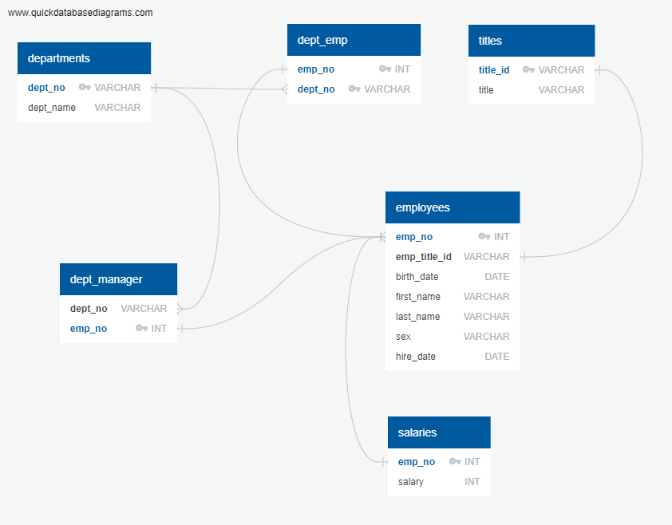
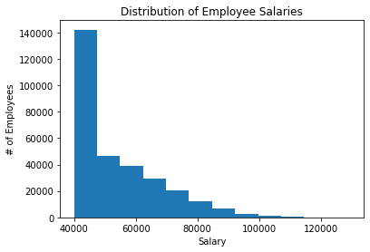
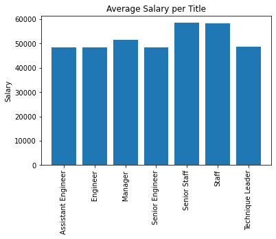

# sql-challenge
 WAUS-VIRT-DATA

### Data Modelling

 - Sketch out ERD


### Data Engineering
 - Use the information you have to create a table schema for each of the six CSV files. Remember to specify data types, primary keys, foreign keys, and other constraints.

```
CREATE TABLE "departments" ...
CREATE TABLE "titles" ...
CREATE TABLE "employees" ...
CREATE TABLE "dept_emp" ...
CREATE TABLE "dept_manager" ...
CREATE TABLE "salaries" ...
```
 - Copy in the csv files

```
COPY departments(dept_no,dept_name) FROM 'departments.csv' DELIMITER ',' CSV HEADER;
COPY titles(title_id,title) FROM 'titles.csv' DELIMITER ',' CSV HEADER;
COPY employees(emp_no,emp_title_id,birth_date,first_name,last_name,sex,hire_date) FROM 'employees.csv' DELIMITER ',' CSV HEADER;
COPY dept_emp(emp_no,dept_no) FROM 'dept_emp.csv' DELIMITER ',' CSV HEADER;
COPY dept_manager(dept_no,emp_no) FROM 'dept_manager.csv' DELIMITER ',' CSV HEADER;
COPY salaries(emp_no,salary) FROM 'salaries.csv' DELIMITER ',' CSV HEADER;
```

### Data Analysis

List the following details of each employee: employee number, last name, first name, sex, and salary.
```
SELECT e.emp_no,e.last_name,e.first_name,e.sex,s.salary
FROM employees AS e
JOIN salaries as s
ON e.emp_no = s.emp_no;
```
List first name, last name, and hire date for employees who were hired in 1986.
```
SELECT * FROM employees 
WHERE hire_date >= '1986-01-01' 
AND hire_date < '1987-01-01';
```

List the manager of each department with the following information: department number, department name, the manager's employee number, last name, first name.
```
SELECT d.dept_no,d.dept_name,dm.emp_no,e.last_name,e.first_name
FROM departments as d
JOIN dept_manager as dm
ON d.dept_no = dm.dept_no
JOIN employees as e
ON dm.emp_no = e.emp_no;
```

List the department of each employee with the following information: employee number, last name, first name, and department name.
```
SELECT de.emp_no, e.last_name,e.first_name,d.dept_name
FROM employees as e
JOIN dept_emp as de
ON e.emp_no = de.emp_no
JOIN departments as d
ON de.dept_no = d.dept_no;
```

List first name, last name, and sex for employees whose first name is "Hercules" and last names begin with "B."
```
SELECT first_name,last_name,sex 
FROM employees
WHERE first_name = 'Hercules'
and last_name LIKE 'B%';
```

List all employees in the Sales department, including their employee number, last name, first name, and department name.
```
SELECT e.emp_no,e.last_name,e.first_name,d.dept_name
FROM departments as d
JOIN dept_manager as dm
ON d.dept_no = dm.dept_no
JOIN employees as e
ON dm.emp_no = e.emp_no
WHERE d.dept_name = 'Sales';
```

List all employees in the Sales and Development departments, including their employee number, last name, first name, and department name.
```
SELECT e.emp_no,e.last_name,e.first_name,d.dept_name
FROM departments as d
JOIN dept_manager as dm
ON d.dept_no = dm.dept_no
JOIN employees as e
ON dm.emp_no = e.emp_no
WHERE d.dept_name = 'Sales'
OR d.dept_name = 'Development';
```

In descending order, list the frequency count of employee last names, i.e., how many employees share each last name.
```
SELECT last_name,count(last_name)
FROM employees
GROUP BY last_name
ORDER BY count DESC;
```

### Bonus

#### Salary Distribution


#### Average Salary Per Title


In the end, I am but a fool
||salary	|title|	emp_no	|first_name	|last_name|
|-|-|-|-|-|-|
|42305	|40000	|Technique Leader|	499942|	April	|Foolsday|
